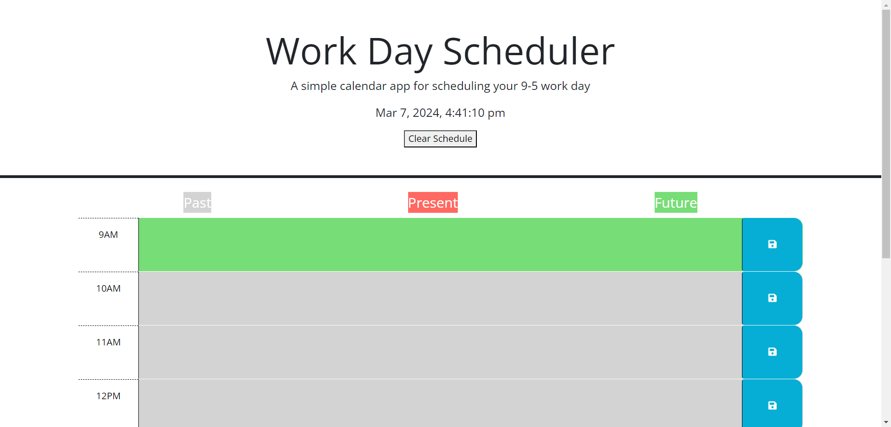
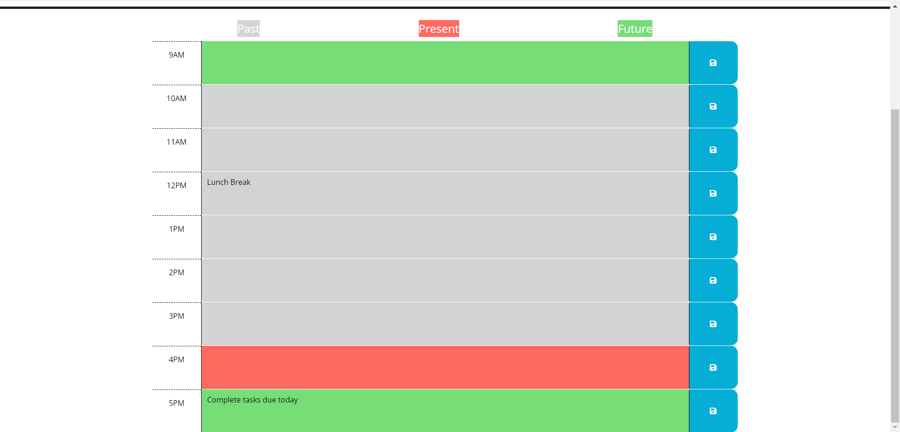

# Work Day Scheduler - 9-5 Edition

## Description

This Work Day Scheduler is a simple calendar app for scheduling your 9-5 work day. It allows a user to save events for each hour of a typical working day (9am-5pm). Employees with busy schedules can add important events to a daily planner so they can manage their time effectively. 

## Installation

Web browser with local storage is required to use this application. The application can be accessed at:
https://jinkc21.github.io/work-day-scheduler/

## Usage

The current day is displayed at the top of the calendar. Timeblocks are displayed for standard business hours and are color coded to indicate whether it is in the past, present, or future. When a timeblock is selected, events can be inputted into the text area. The event is then saved using the save button. When the page is reloaded, the events will still be displayed unless the schedule is cleared using the "clear schedule" button or the local storage is reset.

Here is an example of how the app can be utiliized:

## Credits

Day.js was used to work with the date and time:
https://day.js.org/en/

MDN Web Docs provided material for local storage components as well as using "this":
https://developer.mozilla.org/en-US/docs/Web/API/Window/localStorage
https://developer.mozilla.org/en-US/docs/Web/API/Storage/clear
https://developer.mozilla.org/en-US/docs/Web/JavaScript/Reference/Operators/this

## License

MIT License

Copyright (c) 2024 jinkc21

Permission is hereby granted, free of charge, to any person obtaining a copy
of this software and associated documentation files (the "Software"), to deal
in the Software without restriction, including without limitation the rights
to use, copy, modify, merge, publish, distribute, sublicense, and/or sell
copies of the Software, and to permit persons to whom the Software is
furnished to do so, subject to the following conditions:

The above copyright notice and this permission notice shall be included in all
copies or substantial portions of the Software.

THE SOFTWARE IS PROVIDED "AS IS", WITHOUT WARRANTY OF ANY KIND, EXPRESS OR
IMPLIED, INCLUDING BUT NOT LIMITED TO THE WARRANTIES OF MERCHANTABILITY,
FITNESS FOR A PARTICULAR PURPOSE AND NONINFRINGEMENT. IN NO EVENT SHALL THE
AUTHORS OR COPYRIGHT HOLDERS BE LIABLE FOR ANY CLAIM, DAMAGES OR OTHER
LIABILITY, WHETHER IN AN ACTION OF CONTRACT, TORT OR OTHERWISE, ARISING FROM,
OUT OF OR IN CONNECTION WITH THE SOFTWARE OR THE USE OR OTHER DEALINGS IN THE
SOFTWARE.
---